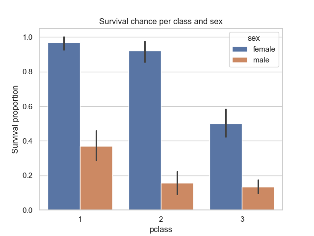
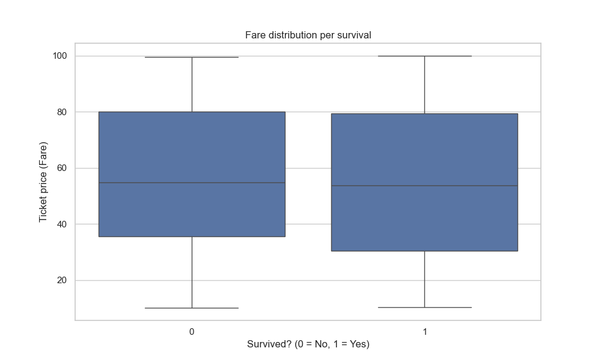

# Titanic Project - Data Analysis

This project analyzes Titanic passenger data to discover which factors influenced survival rates.

## Visualizations

## Key Insights
- **Gender:** Women had a significantly higher survival rate.
- **Age:** Children (under 12 years old) had a ~57% survival rate compared to ~36% for adults.
- **Socio-economic Status:** Social class was a determining factor: the higher the class, the higher the chance of being saved.
